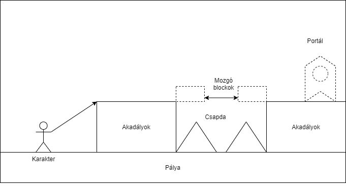

# 1. Jelenlegi helyzet leírása
 - Mára már meghaladja a 3 milliárd embert, azon embereknek a száma, 
akik játszanak valamilyen számítógépes játékkal és ezen emberek száma folyamatosan csak nő,
(https://www.dfcint.com/product/video-game-consumer-segmentation-2/).
- Ez azt jelenti, hogy már nem csak a fiatalok körében elterjedtek a videójátékok,
hanem a középkorúak illetve az idősebb körökben is. Ez a sok egy óriási piaci lehetőséget nyúlt.

# 2. Vágyálomrendszer leírása
 Célunk egy olyan játék készítése, ami megfelelően egyszerű ahhoz, hogy bárki leülhessen elé, ez egy 2Dplatformer játék lesz, aminek a célja a pálya jobb oldalába való eljutás.
- A játék offline fog futni a játékos számítógépén.
- A játékos egy karaktert irányít át különböző akadályokon a cél az , hogy elérje a pálya végét.
- A játéknak egy menüvel kell kezdődnie, ami elindítja magát a pályát.
- Jó lenne ha 2 személy tudná játszani egyszerre.
- jó lenne ha lenne egy pontrendszer is a játékban. 
- A UI-nak egyszerűnek és letisztultak kell lennie, hogy mindenki számára érthető legyen a játék kezelése, illetve a célja.

# 3. Jelenlegi üzleti folyamatok modellje

- A játék jelenleg sehol sem érhető el.
- A játék tervezés alatt áll.

# 4. Igényelt üzleti folyamatok modellje

- A játék bármikor játszható.
- A játék használatához, szükséges lesz egy eszkőz, amely biztosítja a szükséges erőforrásokat. Illetve szükséges a program egy másolatával rendelkezni.
- A játék alatt a játékos célja minél több akadályt kikerülni és messzebb jutni a játék pályán.
- A játék akkor ér véget, ha: a játékosnak nem sikerül kikerülni az akadály; az eszköz, amit játék közben használ meghibásodik.
- A játékot befejezően, a játékos dönthet, hogy elhagyja a játékot, vagy újra próbálja.

# 5. Követelménylista

- Gyors betöltődés.
- Használható menü.
- Egyértelmű játékvezérlés.
- Pixel art dizájn.
- Minimalista kinézet.
- Könnyen alakítható pályák.
- A kamera kövesse a karaktert játék közben.

# 6. Használati esetek

# 7. Képernyőtervek

  -A menühöz három egyszerű gomb elég, letisztult és érthető, egymás alá helyezve. Innen elindíthatjuk a játékot, kikapcsolhatjuk vagy akár segítséget kérhetünk.

  -A mappon karakterünk mozgatásával áthaladunk az akadályokon. 

# 8. Forgatókönyvek

A játék megnyitásakor a felhasználó három lehetőség közűl választhat, melyek a : Start; Help; Quit. 
  -A 'Start' gomb megnyomásával értelemszerűen elkezdődik a játék, ami az első 'map' felületére teszi az irányítható karakterünket. Ezt a karaktert kell eljuttasuk a pálya végéig anélkűl, hogy meghalna a karakterünk. A mappokon külömböző ügyességi feladatok lesznek amit a karakter mozgatás és ugrás segítségével tudunk elvégezni. A mappon töbféle akadályt is fell lesz állítva a felhasználói élmény érdekében.  
  -A 'Help' gomb megnyomásával egy egyszerű magyarázat lesz a karakterünk mozgatásához tartozó gombokról. Ezek a gombok lesznek a [W, A, S, D].
  -A 'Quit' gomb magától érthetően pedig a játék kikapcsolása funkciót fogja ellátni. 

# 9. Funkció – követelmény megfeleltetés

Játék megynyitása után, megjelenik egy egyszerü három menüpontból álló menü:

- Start - elindítja a játékot.
- Help - a felhasználónak segítséget nyújt a játék használatában.
- Quit - kilép a játékból.

A "Start" gombra kattintva elkezdődik a játék, ahol lehetőség van W,A,S,D-vel irányítani a karaktert 2D-s síkon, 
platformokon ugrálva haladhatunk a cél felé különböző akadályokkal megküzdve, a cél elérésével a játékos dönti el, 
hogy kilép a jétékból, vagy újat kezd.

A játék kinézete minimális, pixel art stílusu, a gyors betöltődés és az egyszerű kivitelezés érdekében.

# 10. Fogalomszótár

- Pixel art - digitális művészet olyan formája, ahol a képeket pixel szinten szerkesztik. Ez a stílus a 8 és 16 bites számítógépekből, videojáték-konzolokból
származik.
- 2D-s sík - egy X, vízszintes valamint egy Y, függőleges koordinátából álló tér.
- Map - térkép, jelen esetben minden egyes tereptárgyat jelent, ami nem az irányított karakter.
- UI - Felhaználói felület, az a konkrét rendszer, amellyel a felhasználónak érintkeznie kell, amikor az adott terméket, vagy szolgáltatást igénybe veszi.
- Offline - Az online ellentétje, azaz kapcsolattal nem rendelkező és/vagy nem elérhető rendszerek, eszközök leírására használt jelző. Az offline átvitt értelemben azokat a folyamatokat, fogalmakat is jelenti, amelyek működésükben az Internettől független módon léteznek vagy működnek.
- Platformer - A platformjáték (más néven platformer vagy Jump ’n’ Run) egy videójáték-műfaj, az akciójáték alműfaja. A játékos által irányított karakternek platformokon keresztül kell ugrálnia és/vagy különböző akadályokat kell átugrania. A játékos feladata, hogy a karakterével megfelelő időben ugorjon, hogy tovább tudjon menni vagy ne essen le. Az ugráson kívül más mozgáselem is szerepelhet mint az úszás, mászás vagy repülés. Platformjátéknak nevezhető az olyan játék, aminek szerves részét képezi a platformokon való ugrálás.
